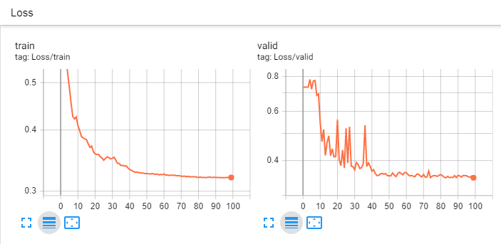

# LumbarSegmentation

Our motivation is to optimize current models on accuracy and robustness regarding lumbar spine images.

## Descriptions
This project contains [Pytorch](https://pytorch.org/) implementation of various basic models.

- [x] **UNet** proposed in the paper [U-Net: Convolutional Networks for Biomedical Image Segmentation](https://arxiv.org/abs/1505.04597)

## Prerequisties

- Python 3.7
- [Pytorch 1.2](https://pytorch.org/get-started/locally/)
- torchsummary
- tb-nightly

## Usage

```bash
$ python train.py
```

## Results
* Generated samples with combined losses(100th epochs)

* The loss of training/validing dataset


